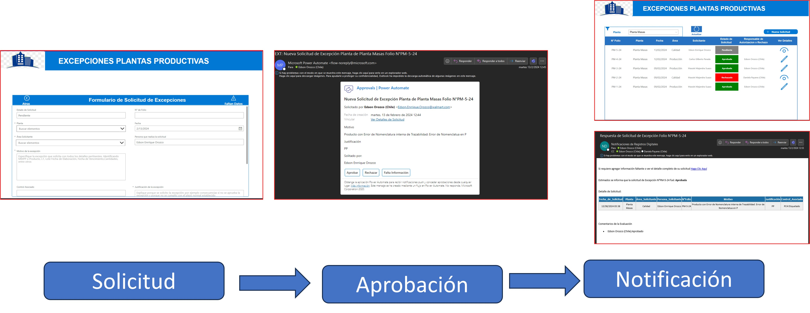

# Analista de datos & Desarrollador Power Platform

##### Habilidades Técnicas: Power BI, Power Apps, Power Automate, Excel

## Educación
Ing. Químico | Universidad de Carabobo (_Febrero de 2018_)

## Certificaciones
- [Microsoft Power BI Data Analyst, Coursera (_Junio de 2024_)](https://coursera.org/verify/professional-cert/Z6MNMYPZKJMQ)
- [Microsoft Certified: Power Platform Fundamentals,  Coursera (_Febrero_2024_)](https://coursera.org/verify/DBJ64MPY2J5T)

## Experiencia Laboral
**Analista de datos & Desarrollador Power Platform en Walmart Chile (_Diciembre 2021 al Presente_)**
- Análisis de Datos y Generación de Reportes con Power Bi para visualización de KPI'S
- Gestión de Activos en Áreas de Trabajos de Power Bi Service
- Generación y Gestión de Bases de Datos
- Creación y Gestión de Aplicación con Power Apps (Canvas y Basadas en Modelos)
- Creación y Gestión de Flujos de Trabajos con Power Automate

## Proyectos
### Solución digital para gestión de procesos productivos en una fábrica de alimentos
[Ver Muestra](https://youtu.be/hXp16OyOjEc)

Solución desarrollada para monitorear, verificar y trazar  las etapas de una línea productiva usando **Power Apps**, con el objetivo de digitalizar este proceso que anteriormente se realizaba en papel. Esta herramienta, permitió un mejor control de los procesos productivos al integrar la aplicación con flujos automáticos de **Power Automate** que notificaban en tiempo real desviaciones de monitoreos, modificaciones de registros y reportes de verificación. Tambien se eliminó la digitación manual para la obtención de los KPI'S los cuales se obtienen directamente mediante informes y reportes en **Power BI**.

### Herramienta para gestión de excepciones
[Ver Muestra](https://youtu.be/-wixUv334Uw)

Se trata de una herramienta que permite administrar excepciones asociadas a alguna etapa del proceso productivo del cliente. La solicitud de excepciones se realiza mediante un formulario web basado en **Power Apps**, una vez que se registra la solicitud, se desencadena un flujo automático (**Power Automate**)  que envia un comprobante de solicitud por correo a las partes interesadas y también una solicitud de aprobación que llega a los roles asignados, cuando se emite una respuesta al flujo de aprobación esta se notifica por correo a todas partes involucradas.

### App para análisis de producto
[Ver muestra](https://youtu.be/2FYGTEuBKx0)
Consiste en una aplicación de lienzo desarrollada en **Power Apps** que permite registrar los resultados de un análisis de producto, el modelo de datos está diseñado para filtrar los productos según la línea productiva seleccionada y los parámetros de producto se adaptan dinámicamente según el producto que se seleccione, una vez registradas las mediciones la app determina el resultado mediante funciones de estadística básica y lo muestra en contraste con los valores aceptables para que el analista pueda escribir una conclusión o comentarios al respecto. Al guardar los resultados estos desencadenan un flujo de nube automatizado que envía el reporte del análisis en formato HTML por correo electrónico para que sea visto por las partes interesadas. Finalmente los datos registrados están disponibles en una lista SharePoint para que puedan ser utilizados para un análisis posterior mas profundo.

